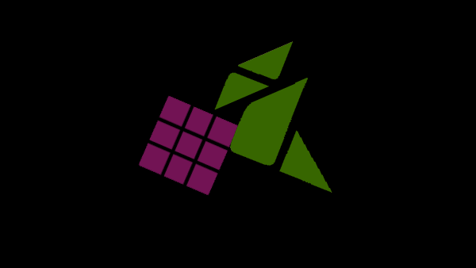
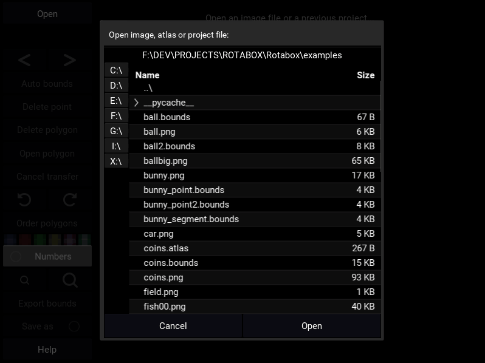

# Rotabox
*version 0.13.0 (kivy 1.10.0)*
#### A kivy widget with revolving collision detection, custom bounds and multitouch interactivity.



Rotabox is a *kivy widget* with customizable 2D bounds that follow its rotation.  
The users can shape their own, specific bounds, to fit an image (or a series of images in an animation), using  a visual editor *(See Rotaboxer below)*.

Essentially, it's a widget that, while rotating, is able to track specific points on its visual and it can also be used just for that.

Rotabox also offers multitouch interactivity (drag, rotation and scaling).
___
## Features & particularities

### Collision detection methods
 Rotabox offers two collision approaches. 
 They can't be both used at the same time on the same widget and, normally, collisions are thought to happen between widgets that use the same detection method. 
 Combinations between the two are possible but more expensive.
 
* Segment intersection detection (Default method):  
    (See [Introduction to Algorithms 3rd Edition](https://mitpress.mit.edu/books/introduction-algorithms) (ch.33 Computational Geometry)  
    and ['Line Segment Intersection' lecture notes by Jeff Erickson] (http://jeffe.cs.illinois.edu/teaching/373/notes/x06-sweepline.pdf))
    * Supports open-shaped bounds.
    * Interacts with Rotaboxes that use either collision method (more expensive if method is different) and regular widgets.
    * In a positive check against a Rotabox of the same method, instead of *True*, both the intersected sides' indices and their respecrive polygons' indices are returned, in the form of [this_pol_index, this_side_index, that_pol_index, that_side_index].

* Point membership in polygon detection:  
    (See [Even-odd rule](https://en.wikipedia.org/wiki/Even%E2%80%93odd_rule "")) 
    * It can be faster when dealing with complex shapes, as it can benefit from breaking these shapes into more simple ones when making the bounds in the editor.
    * Requires mutual collision checks (Both parties should check for an accurate reading).
    * Interacts with Rotaboxes that use the same collision method (and regular widgets but behaving, itself, like a regular widget while doing so).
    * In a positive check against a Rotabox of the same method, instead of *True*, the checker's collided polygon's index is returned, in a tuple (i) to always evaluate to True.
	
### Open collision bounds (Segment method only)
 If a polygon is open, the segment between the last and first points of the polygon is not considered in the collision checks.
 Since the segment collision method is only concerned with the polygon's sides, a widget can 'enter' an open polygon, passing through the opening, and then hit the back wall from inside, for example.
 Note that *collide_point* doesn't work for an open polygon (i.e. an open polygon cannot be touched).

### Visual point tracking
 Since a rotating widget doesn't really rotate, its points lose their reference to its visual (Positional properties like *top* or *center* don't rotate).
 Rotabox can track any of its own points while rotating, provided that they are predefined (Hence, the custom bounds' ability).
 They then can be accessed using their indices.
 This can be useful, for example, in changing the point of rotation while the widget is rotating.

### Touch interactivity 
 Due to the differences between the Scatter and Rotabox concepts, a way to combine the two couldn't be found. 
 So, Rotabox uses the Scatter widget's code, modified to act on the actual size and position of the widget and child (essential for accurate collision detection). 
 It supports single and multitouch drag, rotation and scaling (the latter two use the *origin* property in the singletouch option).
	
### Cython option
 Rotabox will try to use a compiled cython/c module (*cybounds.so* or *cybounds.pyd*), for an about X5 speedup.
 The module needs to be compiled for specific platforms, using the provided *cybounds.c* and *setup.py* files, and be put where *rotabox.py* is (more info in *cythons* folder).

### Restrictions
* In order to be able to maintain any arbitrary aspect ratio (e.g. its image's ratio), Rotabox can't use the *size_hint* property.  

* Rotabox can only have one child.  
 It's meant to be an *Image* but not necessarily.  
 Grandchildren, however, can collide independently, only if the widget is not rotated ( *angle* must be *0* ).


_______
# API

## Basic Usage
To use Rotabox, just include *rotabox.py* in your project files.

```python
    from rotabox import Rotabox
    ...
	rb = Rotabox()
	rb.add_widget(Image(source='img.png'))
	self.add_widget(rb)
```
The instance's default bounds will be a rectangle, the size of the image, that rotates with it.

## Basics

**angle** *NumericProperty* (0):  
 The angle of rotation in degrees.

**origin** *AliasProperty*:  
 Sets the point of rotation. Default position is the widget's center.

**image** *ObjectProperty*:  
 Rotabox's only child will most likely be an *Image*.  
 If not so, Rotabox will attempt to find the topmost Image in its tree and assign it to this property by default.  
 Otherwise, the user can specify an *image* somewhere in the widget's tree, that the custom bounds will use as a reference.  
 An .atlas spritesheet can also be used as an animation source and different bounds can be defined for each frame.

**aspect_ratio** *NumericProperty* (0.)  
 If not provided, *image*'s ratio is going to be used.

## Customizing the Collidable Area

> **Rotaboxer** Visual editor.
>  An easy way to define the *custom_bounds* of Rotabox.  
>  To use it, run *rotaboxer.py* directly. It can be found in the *visual_editor* folder.  
>  Open a *.png* image or an *.atlas* file, let the editor draw bounds for it while you control the accuracy/complexity, inspect for a final touch and export the resulting code to clipboard, to paste in a Rotabox widget.
> 
> 

**custom_bounds** *ObjectProperty* (`[[(0, 0), (1, 0), (1, 1), (0, 1)]]`)  
 This is where the custom bounds are being defined.  
 It's also the output of the Rotaboxer tool ( *above* ).
 It can be a *list* of one or more polygons' data as seen in its default value, above. 
 
 Each polygon's data is a *list* of point tuples `(x, y)`.  
 Points' values should be expressed as percentages of the widget's *width* and *height*, where `(0, 0)` is widget's `(x, y)`,  
 `(1, 1)` is widget's `(right, top)` and `(.5, .5)` is widget's *center*.
 
 Here's another example with more polygons:

```python
rb.custom_bounds = [[(0.013, 0.985), (0.022, 0.349),
                     (0.213, 0.028), (0.217, 0.681)],
                    [(0.267, 0.346), (0.483, -0.005),
                      (0.691, 0.316), (0.261, 0.975)],
                    [(0.539, 0.674), (0.73, 0.37),
                      (0.983, 0.758)]]
```

*custom_bounds* can also be a *dictionary*, in case of animated bounds (different bounds for different frames of an animation sequence in an *.atlas* file), where the *keys* correspond to the frame names in the *.atlas* file and each *item* is a *list* of one or more polygons' data like the above.
  
Here's an example of such a *dictionary*:

```python
rb.custom_bounds = {'00': [[(0.201, 0.803), (0.092, 0.491),
                            (0.219, 0.184), (0.526, 0.064)],
                           [(0.419, 0.095), (0.595, 0.088),
                             (0.644, 0.493)]],
                    '01': [[(0.357, 0.902), (0.17, 0.65),
                            (0.184, 0.337), (0.343, 0.095),
                            (0.644, 0.098)]],
                    '02': [[(...
                             ...
                             ... etc ]]}
```

**segment_mode** *BooleanProperty* (True):
 Toggle between the two collision detection methods *(See Features above)*.
    
**open_bounds** *ListProperty*:
 If a polygon's index is in this list, the segment between the last and first points of the polygon is not considered in the collision checks (segment_mode only).

**pre_check** *BooleanProperty* (False):
 A collision optimization switch for larger widgets in Cython.
 It's always True in Python but in Cython, for small widgets (under 45 points), the slight tax of extra calculations outweighs any benefit in collision.

## Touch interface
Most of it is familiar from the Scatter widget.

**touched_to_front** *BooleanProperty* (False)
 If touched, the widget will be pushed to the top of the parent's widget tree.

**collide_after_children** *BooleanProperty* (True)
 If True, limiting the touch inside the bounds will be done after dispaching the touch to the child and grandchildren, so even outside the bounds they can still be touched.
*IMPORTANT NOTE: Grandchildren, inside or outside the bounds, can collide independently ONLY if widget is NOT ROTATED ( *angle* must be *0* ).*

### Single touch definitions:
**single_drag_touch** *BoundedNumericProperty* (1, min=1)
 How many touches will be treated as one single drag touch.

**single_trans_touch** *BoundedNumericProperty* (1, min=1)
 How many touches will be treated as one single transformation touch.

### Single touch operations:
**allow_drag_x** *BooleanProperty* (False)

**allow_drag_y** *BooleanProperty* (False)

**allow_drag** *AliasProperty*

**single_touch_rotation** *BooleanProperty* (False)
 Rotate around *origin*.

**single_touch_scaling** *BooleanProperty* (False)
 Scale around *origin*.

### Multitouch rotation/scaling:
**multi_touch_rotation** *BooleanProperty* (False)

**multi_touch_scaling** *BooleanProperty* (False)


## Utility interface

**pivot** *ReferenceListProperty*
 The point of rotation and scaling.
 While *origin* property sets *pivot*'s position, relatively to widget's *size* and *pos*, *pivot* itself can be used to position the widget, much like *pos* or *center*.

**ready** *BooleanProperty* (False)
 Useful to read in cases where the widget is stationary. 
 Signifies the completion of the widget's initial preparations.
 Also, its state changes to True after every size change or reset.
 
**prepared** *BooleanProperty* (False)
 Its state change signifies a reset.
 The reset completion signal, however, is the consequent *ready* state change to True.
 
**get_point(pol_index, point_index)** *Method*
 Returns the current position of a certain point.
 The argument indices are based on *custom_bounds*' structure.
 
**read_bounds(filename)** *Method*
 Define *custom_bounds* using a Rotaboxer's project file.
 (e.g. self.custom_bounds = self.read_ bounds("images/car.bounds")
 To work, *size* should be already defined.
 
**draw_bounds** *NumericProperty* (0)
 This option can be useful during testing, as it makes the widget's bounds visible.
 (1 for bounds, 2 for bounds & bounding boxes)
 
**scale** *AliasProperty*
 Current widget's scale, based on widget's original size (User's initial *size* input or *image*'s *texture_size* ).

**scale_min** *NumericProperty* (0.01)

**scale_max** *NumericProperty* (1e20)
 Optional scale restrictions.

_
> **Note:** *Rotabox* is being developed on Windows and hasn't really been tested on other platforms.

